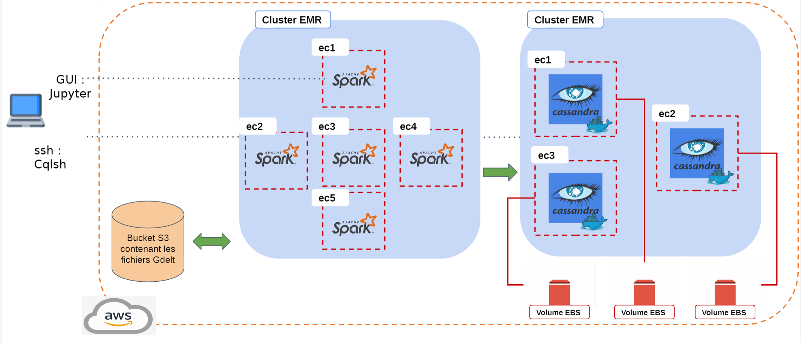

# AWS project - GDELT dataset

the [GDELT](https://www.gdeltproject.org/) Project monitors the world's broadcast, print, and web news from nearly every corner of every country in over
100 languages and identifies the people, locations, organizations, themes, sources, emotions, counts, quotes, images and
events driving our global society every second of every day, creating a free open platform for computing on the entire 
world.

The goal of this project is to propose a resilient and efficient distributed storage system on AWS that allow users to 
query some information on GDELT dataset.

## Infrastructure



### Prerequisites

You need to install the following dependencies before the creation of the platform
- [aws2 cli](https://docs.aws.amazon.com/cli/latest/userguide/install-cliv2-linux-mac.html)
- [ansible](https://docs.ansible.com/ansible/latest/installation_guide/intro_installation.html) (also installed through pip in the requirements.txt file, see below)

### Launch the AWS architecture

__Configure aws2 cli__

First, aws2 cli needs to know your credentials to communicate with aws services through your account. By creating a
credential file in the `~/.aws` folder, aws2 cli will be able to interact with the platform :

```shell script
$ vim ~/.aws/credentials
```

Then copy-past the following lines with your keys instead of `X`:

```shell script
[default]
aws_access_key_id=XXXXXXXXXX
aws_secret_access_key=XXXXXXXXXXX
aws_session_token=XXXXXXXXXX
```

### Key pair

A key pair is required to connect to the cluster machines. If not already configured, this key pair may be generated from the EC2 dashboard, section key pairs. Or through AWS cli:

```sh
$ aws2 ec2 create-key-pair --key-name gdeltKeyPair-educate 
```

__Copy the content of the private key, surrounded by ----- BEGIN RSA PRIVATE KEY ----- and ----- END RSA PRIVATE KEY ----- to gdeltKeyPair-educate.pem

The access rights of the gdeltKeyPair-educate.pem file shall be restricted to you only:

```sh
$ chmod 600 gdeltKeyPair-Student.pem
```

You may check the availability of your key pair with:

```sh
$ aws2 ec2 describe-key-pairs
```

Note that key pairs are restricted to each user.

### Clone the project and add your .pem file

gdeltKeyPair-educate.pem for the name of the pem file is mandatory.

```shell script
$ git clone https://github.com/tonio73/GDELT-Explore.git
$ mkdir GDELT-Explore/secrets && cp [path_to_pem] secrets/gdeltKeyPair-educate.pem
```

## Use the _gdelt_ cli

```shell script
$ cd GDELT-Explore/
$ pip install -r requirements.txt
```

In the  __script/__ folder, there is a  __gdelt.py__ script file which contains the cli for the project. This cli provides options to:
- Create the ec2 instances for the cluster
- Create the EBS volumes make cassandra data persistent
- Attach a volume to an ec2 instance
- Deploy a cassandra container on many ec2 instances

To get some help, run the following command:

````shell script
$ ./gdelt.py --help
````
## Create a spark cluster

```sh
$ ./gdelt.py --create_cluster spakr
```

Caveats:

- The number of S3 connections need to be increased to at least 100, see sparkConfiguration.json and [1]
- Open the 

## Create a Cassandra cluster

````shell script
$ ./gdelt.py --create_cluster cassandra
````
Create the volumes:

````shell script
$ ./gdelt.py --create_volume 3 [availability zone of the cluster]
````
Attach a volume (A volume need to be formatted when you use it for the first time):

````shell script
$ ./gdelt.py --attach_volume --first_time [instance_id] [volume_id]
````

Deploy Cassandra nodes

````shell script
$ ./gdelt.py --deploy_cassandra [instance_id_1 starts with 'i-'] [instance_id_2] ... [instance_id_n]
````

## Connect to the cassandra cluster

__CQLSH__

You can access to the Cassandra cluster with the console:

```shell script
$ ssh -i [path_to_pem] hadoop@[public_dns_instance]
```

Once connected to the instance, enter in the docker node to run the cqlsh console:

```shell script
$ docker exec -it cassandra-node cqlsh
```

You can also check the status of the different cluster nodes:

```shell script
$ docker exec -it cassandra-node nodetool status
```

## Connect to the spark cluster

You have two ways to access to the cluster:

- Zeppelin
- spark-shell
- spark-submit

#### SSH connection to the cluster

__You first need to open inbound connections on port 22 as SSH/TCP/Anywhere from the resource group of the master.__

```sh
$ ssh -i ./secrets/gdeltKeyPair-educate.pem  -L 8088:127.0.0.1:8088 \
-L 8042:127.0.0.1:8042  -L 50470:127.0.0.1:50470  -L 50475:127.0.0.1:50475  \
-L 18080:127.0.0.1:18080  -L 8890:127.0.0.1:8890  -L 8888:127.0.0.1:8888  \
-L 16010:127.0.0.1:16010 -L 9443:127.0.0.1:9443 hadoop@[cluster master URL]
```

Reference: https://docs.aws.amazon.com/emr/latest/ManagementGuide/emr-web-interfaces.html

### Submit a spark program

Initially create a S3 bucket to load the program to:

```sh
$ aws s3api create-bucket --bucket fufu-program --region us-east-1 --acl aws-exec-read
```

Copy the Jar to S3:

```sh
$ aws s3 cp target/scala-2.11/GDELT-Explore-assembly-0.1.0.jar s3://fufu-program/jars/
```

Submit the job to Spark using add-steps on the EMR cluster, example for the GDELT download:

```sh
$ aws emr add-steps --cluster-id [id starting with 'j-'] --steps file://script/submitMainDownload.json

$ aws emr list-steps --cluster-id [id starting with 'j-']
$ aws2 emr describe-step --cluster-id [id starting with 'j-'] --step-id [id starting with 's-']
```


## Cluster surveillance

Check cluster status:

```sh
$ aws2 emr list-clusters
```

Describe cluster, given the id listed in above command : 

```sh
$ aws emr describe-cluster --cluster-id [id starting with 'j-']
```

Terminate cluster:

```sh
$ aws2 emr terminate-clusters --cluster-ids  [id starting with 'j-']
```

# Extract-Load-Transform (ETL)

The ETL is split into two parts:

1. Download the data from GDELT to an S3 storage
2. Transform and load to Cassandra the required views

First part is 1 program. The second part is split into 4 programs corresponding to the 4 queries specified in the project goals.

All 5 ETL programs are in the Scala SBT project.

## Pre-requisite

- Scala Build Tool (SBT)
- IntelliJ IDE
- Git

All the JAR dependencies are installed automatically through SBT

## Install the project

1. With Git, clone the project from the Github source repository
2. Open the project folder with IntelliJ
3. When first loading the project IntelliJ, the SBT files shall be imported
4. When pulling source code update from Github, it might be required to reload the SBT file

## Configuration

- Logging configured in src/main/resources/log4j.properties
  - Currently to console (TO COMPLETE)

## Build ETL programs

Either :

- Through IntelliJ build

- Or with the command: 

  ```shell
  $ sbt assembly
  ```

- Or, with run of a program included:

  ```shell
  $ ./build_and_submit.sh [programName]
  ```

- Or, with deploy and run to AWS included : 

  ```sh
  $ ./aws_build_and_submit.sh [cluster ID starting with 'j-'] [script/submissionScript.json]
  ```

## Run ETL programs

As seen above, some of the build scripts also deploy and run the program. It is also possible to run the program from the command line.

To run locally : 

```sh
$ spark-submit --class fr.telecom.[ProgramName] target/scala-2.11/GDELT-Explore-assembly-*.jar
```

To run locally from the IntelliJ user interface:

- Edit a run configuration
- Select the class of the main program to run
- Set the program option: **--local-master**
- Set the classpath module to 'mainRunner'$
- Save edit and execute

On AWS : 

```sh
$ aws2 emr add-step --cluster-id [ID of cluster start with 'j-'] [file://script/submissionScript.json]
```

This will create a step on the cluster, the step surveillance is as explained in section "Cluster surveillance"

### Common command line options to the ETL programs

All ETL programs (MainDownload, MainQueryX) have the following options:

- **--ref-period** : define the reference period as the prefix to the GDELT files. Example : '20190115'. Default set in class fr.telecom.Context
- **--local-master** : to be used in Intellij to force declaration of the Spark master as local
- **--from-s3** : use data from S3 for the MainQuery, and to S3 if Cassandra IP is not set (below)
- **--cassandra-ip** : to use within the EMR cluster only, sets the private IP of one of the Cassandra nodes (LATER : more than one !)

## Download GDELT data

#### Locally

Create a folder /tmp/data 

Run the MainDownload program from the IDE or using spark-submit as explained above

Specific command line options :

- **--index** : download the masterfile indexes first
- **--index-only** : download the masterfile indexes and stop
- **--to-s3** for the MainDownload to save files to S3

#### On AWS

See section "Run ETL programs", to apply with script/submissionMainDownload.json

## ETL for queries 

NOTE : if running a new Cassandra cluster, edit the submission scripts to set the private IP of one of the Cassandra nodes.

| Class                 | AWS submission scripts           |
| --------------------- | -------------------------------- |
| fr.telecom.MainQueryA | script/submissionMainQueryA.json |
| fr.telecom.MainQueryB | script/submissionMainQueryB.json |
| fr.telecom.MainQueryC | script/submissionMainQueryC.json |
| fr.telecom.MainQueryD | script/submissionMainQueryD.json |

```sql
aws2 emr add-steps --cluster-id [cluster_id] --steps "file://[json_file]"
```

# Cassandra Queries

### Query A in Cassandra

```sql
USE gdelt;
SELECT * FROM querya LIMIT 20;
```

## References

- [1] https://aws.amazon.com/fr/premiumsupport/knowledge-center/emr-timeout-connection-wait/
